---
---

 Master Geo-Information Science & Remote Sensing 

 Internship report  GRS00000                   

 Building a web-based Geo-visualization of Fieldnames in Drenthe  

 Wageningen Universiteit 

Waag Society, Project; Heritage & Location   

 Niene Boeijen 

 900918-070-088 

 July 2015  

<h1 class ="nocount"> Acknowledgments</h1>

<h1 class = "nocount">Table of Contents </h1>

<h1 class ="nocount"> Abstract</h1>
<h2 class ="nocount"> Keywords</h2>

<h1 class ="nocount"> Abbreviations</h1>

<dl>
  <dt>H&amp;L</dt><dd>Heritage and Location Project</dd>
  <dt>CH</dt><dd>Cultural Heritage</dd>
  <dt>GIS</dt><dd>Geo Information System</dd>
  <dt>ICH</dt><dd>Intangible Cultural Heritage </dd>
  <dt>RCE</dt><dd>Rijksdienst voor Cultureel Erfgoed</dd>
</dl>

# Introduction

The amount of geospatial data has increased rapidly. Geospatial data is created and used increasingly every day in smart phones, digital maps, satellite navigation systems, websites, services and Apps. (MacEachren & Kraak, 2001; Tensen, 2014) Almost 60% of all data is geographically referenced (Hahmann & Burghardt, 2013). Next to that, the modern computer technologies provide better opportunities for institutions, organizations and citizens to create and use geospatial data. (Cartwright, Miller, & Pettit, 2004; Tensen, 2014) Already a wide range of domains, use geo information systems [GIS] for management and decision-making purposes and the fields of application are still expanding.

The magnitude and complexity of data sets with geospatial reference are a challenge in information science. How to transform this data into information and subsequently into knowledge?  Data is a product of research, creation, collection and discovery. It is raw material, often boring, incomplete or inconsequential. It is not yet valuable as communication, for it is not a complete message. Often audiences are presented with data instead of information. {see figure # DIKW pyramid} According to Nathan Shedroff, successful communications do not present data. Transforming data into information by organizing it into a meaningful form, presenting it in an appropriate way and communication context is the process to get the story to the audience. (Shedroff, 1999)  The use of the enormous amount of geo data to inform the general public is also still in development. (Tensen, 2014) Geo-visualization is one of the tools to turn large heterogeneous geo data volumes from information into knowledge. (MacEachren & Kraak, 2001) Geo-visualization integrates scientific visualization, cartography, image analysis, information visualization, data analysis and geographic information systems to provide methods and tools for visual exploration, analysis and presentation of geospatial data. (MacEachren & Kraak, 2001)

<figure class="text-wrap-right">
	<figcaption>DIKW pyramid. From data to wisdom</figcaption>
  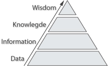
  
<i>(Shedroff, 1999)</i>

</figure>

The web is being used to produce new visual applications, going beyond the status of maps and other representations of geographic information. The World Wide Web has become an extremely efficient channel for transferring data, and also, has great visual capabilities. (Cartwright et al., 2004) There is a need for creating user-centered geo designs to ensure that usable geospatial products are created and delivered. (Cartwright et al., 2004) This raises the interest for geo-visualization in publishing geo-referenced information on the web and getting the enormous amount of available data to the general public (Lin, Gong, & Wang, 1999; Tensen, 2014). Only a few methodologies specifically directed and web geo visualizations emerge which emphasized the scientific information visualization techniques as a way to handle these very large and complex data sets. New visual forms and practices emerge, but how and why do they differ from the more conventional cartographic forms?

In this research, web geo-visualization is explored through a case study in the field of cultural heritage [CH].

There is a big relevance of using geospatial data and geo information systems for the field of cultural heritage conservation purposes. (Droj, 2010) Safeguarding and exploiting CH is high on the agenda and includes the use of digital management systems. (Meyer, Grussenmeyer, Perrin, Durand, & Drap, 2007) Before this was a hand-made task, but with the growing computer science there are new ways for the digital preservation, innovation and updating cultural heritage data. (Deal, 2014)
The next step is to document cultural heritage data across geographic space to preserve and safeguard the amount of cultural heritage data on another level. More and more central and local authorities responsible for cultural heritage use GIS as one of the main infrastructure components when digitalizing CH data.  (Droj, 2010; Meyer et al., 2007; Petrescu, 2007)

For cultural heritage data, the issue of the representation of the results of inventories in mapping systems and updating and maintaining the data, remains open. (Martin, Reynard, Pellitero Ondicol, & Ghiraldi, 2014)  Web-mapping applications can be used to make open access-easy to use formats, for the assessment and promotion of heritage data. (Martin et al., 2014) Web-mapping is a suitable tool for visualizing and updating geo heritage data. In general, much of the spatial data being created and shared is strongly visual in nature, including photographs, video, maps and art (Elwood, 2011)
As stated by Deal:

>Visualizations have the potential to greatly improve search and discovery for online collections, transforming how users interact with digital collections. Furthermore, changing technology is making it easier than ever to incorporate visualizations into search interfaces and websites. The time is ripe for cultural heritage institutions to begin experimenting with data visualization in earnest.

In the cultural heritage field, the temporal dimension plays an important role to explore data. (Cerasuolo, Cutugno, & Leano, 2012) Spatial-temporal data visualization assumes and important role in the data presentation to users. The three dimensional data form of geo data (spatial, temporal and descriptive) helps users understand and gain knowledge in the discovery process.

This research is part of an internship at Waag Society for the project of Heritage & Location. (see chapter $$$) This report describes the work and the results from the development of a web-application for the project Heritage & Location.

 Because a web-application will be build to visualize geographically referenced intangible cultural heritage [ICH] data this will be a design-oriented research. The context is a dataset of field names that were used by the local citizens around 1800 to refer to specific agricultural fields or areas, in Drenthe, the Netherlands. The information about the landscape that is hidden in the names gives a lot of historic information. Yet, noticeable is that this data is only know to a few selected historians. (Spek, Elerie, & Kosian, 2009) The data was supplied by the *Rijksdienst voor Cultureel Erfgoed* and based on the book *“van Jeruzalem tot Elzelakker, levende veldnamen van de Drentse Aa”* (Spek et al., 2009).  More about the data will be described in chapter $$

The research will be build up in 3 parts; first the possible visualization techniques will be explored through literature study. With the chosen techniques, the application will be build, for which certain design goals and requirements will be defined. In the end the application will shortly be evaluated.

## Design goals

1.	The goal is to preserve the living heritage names of Drenthe, which are mostly stored in people’s memory and so will disappear.

2.	Give people the possibility to explore them, discover them. For names cannot be found in the real surroundings, only in people’s memory and now given a place to *exist*.

3.	Getting the stories out of the raw data and show people the surprising knowledge that stays hidden. Help people explore intangible cultural heritage and so the history of the Dutch landscape. Engage people in something interesting about the landscape.

We will do this by building an attractive web-application for the project Heritage & Location to show its potential of visualizing heritage data and preserving them. A big part of the web application will be a geo-visualization of the intangible cultural heritage data set of living field names from Drenthe. The interactivity of the web application, will give users the possibility to discover the names themselves in relation to the environment. The focus is on revealing hidden meaning of the raw data, to the general public.

## Target group

The target group will be defined as the common citizen, living in Drenthe and show an interest in their direct environment and want to discover something about its history. It will not specifically be targeted at children or elderly but to a general public. The target group's language is Dutch.

## The objectives

The target group must feel:

1A. Attracted to use the application
1B. Attracted to stay and play around with the application
1C. Challenged to explore more

The target group must be able to:

2A. Discover the meaning of the field-names in relation to their environment
2B. Discover interesting stories and surprising facts about the field-names
2C. Understand the field-names and their value

The application must be:

3A. Intuitive and simple to use, so it shows quick and surprising results on the actions of the target group
3B. Technically working in an efficient and error-safe way. User friendly.

# Background

In this chapter, the field names are further explained and their role in the cultural heritage field. Therefore, Also the field of cultural heritage is explained and its categories.
Because this research was conducted in the scope of the Heritage and Location project at Waag Society, this will also be elaborated on.
Also some background information on geo-data and the combination with heritage is given.

## Field-names in Drenthe

A field-name is a toponym used for a small area of land or a certain surrounding. Mostly arable land, pasture lands, wastelands, uncultivated areas, hills, valleys, woodlands and swampy areas. The names are thought up by the local inhabitants for practical use in communication and spatial orientation. A field-name is often only existing in oral form and originates, develops or disappears while the environment changes. This makes field-names living heritage (see next section) and it exist only in people's memory. There for field-names fade away from daily lives and disappear with new generations. Written documentation of field-names date from the 17th / 18th and 19th century. Some names live through because they were taken up into official cadastre documentations or other landscape documentations. Nowadays, a new interest arrises for field-names as they can tell us how the landscape used to look in the 18th century. A collection of field-names was gathered by assessing peoples memories, old cadastre documents, maps and other collections. This mental map is now made tangible, by documenting as much as possible and digitalizing them into a GIS system.

Field-names tells us how the landscape used to look, which soil types, vegetation types or animals occurred. They link to specific landmarks or environmental characteristics of the direct village surroundings. The origin and meaning of field-names are mainly influenced by the geography of its direct environment, like water bodies, streams, soil properties and altitude in relation to its surroundings. They can be used for landscape design and planning, knowledge for historical research and inspiration source for artist.
(Spek et al., 2009; “Veldnamen - Encyclopedie Drenthe Online,” n.d.)

### Living heritage

The field-names in Drenthe are called living heritage, which is one of the 4 kinds of cultural heritage categories according to *Volkscultuur* institution;

1.	The physical environment. Including monuments, archeology sites and cultural landscapes.
2.	Paper heritage; Stored in archives and libraries in the form of paper documents, maps and books.
3.	Object collections, owned and displayed by museums. Only focusing on objects.
4.	Living heritage; habits, traditions, religions and cultural events that people experience.
From: (“volkscultuur,” n.d.)

Categories 1,2 and 3 are tangible substances while category 4 is intangible heritage. UNESCO introduces the concept of intangible heritage data in 2003, to safeguard the importance of intangible cultural heritage and distinct it form tangible heritage and natural heritage. (“UNESCO Culture Sector - Intangible Heritage - 2003 Convention :,” n.d.-a)

The Convention of UNESCO introduces five domains of ICH:

-	oral traditions and expressions including language as a vehicle of the ICH
-	performing arts (dance, music, theater)
-	social practices, rituals and festive events
-	knowledge and practices concerning nature and the universe
-	traditional craftsmanship, meaning the skills and knowledge involved rather than the craft product itself

The boundaries between those domains are extremely fluid (“UNESCO Culture Sector - Intangible Heritage - 2003 Convention :,” n.d.-b).
In the scope of the H&L project this research will focus on the connection of place and time in intangible cultural heritage. ICH can be shortly explained as all traditions and rituals of normal life, (Zeijden, 2011) which gives people a sense of identity and continuity. ICH is transmitted from generation to generation and can be constantly recreated by communities due to interaction with their environment. (“UNESCO Culture Sector - Intangible Heritage - 2003 Convention :,” n.d.-b)
Intangible heritage is strongly depended on the features of space and influenced by the space. Of course these traditions, habits , etc., have a place where they take place. Or they are about a place, have a spreading, an origin, a continuation, can cover multiple places, through time. (Karavia & Georgopoulos, 2013) ICH
This applies also for the field-names in Drenthe, which is oral living heritage. Originated with a strong influence of the direct environment it exists in.

##Waag Society
For this research takes place in the scope of the Heritage and Location[H&L] project at Waag Society, they both will be shortly explained.

Waag Society is a Institute for art, science and technology. They develop technical interventions for relevant social innovation.
In 7 labs they conduct creative research in the form of projects, creative care lab, creative learning lab, future heritage lab, future internet lab, open design lab and open wetlab. The Heritage & Location project (see next section) is part of the future internet lab [FIL]. The FIL focuses on the development of big and open data, making internet technology accessible and research the impact of the internet on society.
(“Waag Society,” n.d.)

###Heritage and Location project Waag Society

The project H&L is owned by the Rijksdienst voor het Cultureel Erfgoed [RCE] , and at Waag Society a historical-geo thesaurus and tools are developed.
The H&L project aims to develop a uniform system to link CH collections to existing geometries, with the use of place indicators in the metadata of the CH data.
One of the tools is a historical-geocoder, to make heritage data, geo located and so link it in time and space to other heritage data sets and enrich knowledge. It combines multiple geo data sets with a time component and can be used easily to locate heritage data with a place notification. Big heritage collections with a place indication, though no geo data, can be linked to geometries. The goal of the H&L project is to know every place, administrative boundary, building and address that ever existed in the Netherlands.
Figure $$ shows the overview of the whole H&L project. Now focusing on the historical geocoder and thesaurus.
(“erfgeo,” n.d., “Erfgoed & Locatie,” n.d.)

 Sheme of Hertiage and Location project. Products and Services.

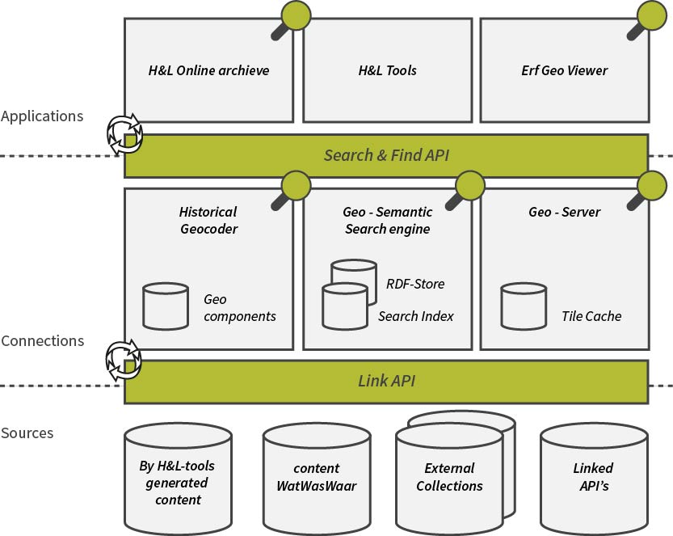

##Cultural heritage data & GIS

There is a big relevance of using geospatial data and geo information systems for the field of cultural heritage conservation purposes. (Droj, 2010)
Explained here are several reasons why a GIS system is beneficial for digitalizing CH data;
One, digitalizing CH data in a web GIS system can serve the goal to preserve the CH, by presenting the digital records in the form of focusing on its relation to place. Geographical information systems have proved their potential to present and exploit cultural heritage data. (Karavia & Georgopoulos, 2013; Meyer et al., 2007)
Second, such a system can be used for research aims. (Karavia & Georgopoulos, 2013) Implementing analysis on the spatial correlation of the CH data. The geographical relation and connection among various cultural heritages can be studied as well as the evolution through time and space and relationships between different datasets.((Karavia & Georgopoulos, 2013; Lai, Luo, & Zhang, 2012) So GIS can help to correlate and exploit heritage spatial relations and enrich the knowledge already existing. (Karavia & Georgopoulos, 2013)
This is also the third and the main goal of the Heritage & Location [H&L] project, for which this research is intended, enriching current datasets, by linking it in space and time to other datasets, which do not contain exact location data but do contain a sense of place in the thematic data description. By doing so, it is possible to improve the information access and improve the richness of the existing data of cultural heritage institutions. (“erfgoedenlocatie.nl,” n.d.)
Assumption is that the place referred to in historical documents, probably refer to the identical real-world place if they are related in name.

Digitalizing heritage as linked data contains the following key aspects:

1.	Identification, making the objects unique and identifiable.
2.	Make it accessible through the Internet
3.	Searchable, making it possible to index by search engines.
4.	Re-usability. Linked-data makes it easy to use the data.

(“DEN | DE BASIS vindbaarheid,” n.d.)

##Geo data
Geospatial data is data with a location, a connection to a location and oriented by their geographical relationships. Geo data has a nature of threefold: spatial, temporal and descriptive. (Mennis et al., 2000)
The spatial dimension can be used to interpret the spatial dimensions and relation of data entities, an absolute and enclosed *space* wherein the geographic phenomena exists. The temporal dimension can be used to interpret the change in the data through time. The thematic dimension is to interpret what the data is about, a property that can be measured and assigned. (Mennis et al., 2000)
The data component only concerns the raw observational data, with location, time and attributes. (Mennis et al., 2000) These three characteristics will be explained in detail in the next sections.

###Spatial dimension
Geo data is different from other data because it is inherently structured with a spatial dimension. An X and Y location and sometimes a Z dimension. This contains the  *where* of a particular phenomenon.
Spatial objects can be physical, real objects in the world, or non-physical phenomena, like administrative boundaries. Continuous data fields cover large areas with no clear boundaries, like rainfall or temperature. A single object on the earth is discrete; they have sharp boundaries, like a house. But also the spatial structure tells a lot about the phenomena, is it random or regular clustered. The general assumption of spatial correlation tells that close things are more correlated then far apart things.

###Temporal dimension
The time of happening of phenomena can be divided into 3 forms, it can happen/exist as a point in time, a period in time or on a certain interval in time. Also time can be classified into the four measurement classes, nominal ordinal discrete or continuous time model.
Nominal would be; the 90ties, Christmas or the WWII.
Ordinal contains relative order time statements like; before, after.
Discrete is in years, seconds, minutes , etc.

Another differentiation is liner versus cyclic time ordering. Linear time is ordered along a path. Cyclic time follows a path of periodic turn phases. Like seasons, day and night. Serial periodic data is periodic time represented on a linear path.

###Thematic dimension
The theme or attribute of a phenomena. The ‘what’ is happening in the world. This data is often stored in the attributes of the data, more then one attributes can exist. This data can be qualitative or quantitative, nominal ordinal discrete or continuous.

##Geo-visualization
Geo-visualization is a combination of communication, scientific information visualization, geographic information systems and cartography. It comes after the collection of data, transformations and analysis. From the real world we go to data and all the modifications to the data. Eventually the data will be  visualized, either a computer or on paper. The perception of people will interpreted the data and turns the data into knowledge. In general, every map is a selective representation of reality and subjected to the interpretation of the human eyes. (Dibiase et al., 1992)(MacEachren & Kraak, 2001) 

###Static geospatial visualization
Geo data has three basic symbols to represent the data, points, lines and polygons. Selecting the right graphic characteristic for data display is a challenging issue. Effective symbolization requires human creativity and judgment.  The classic method for cartography is Bertin’s theory. This provides a classified system with four levels of data measurement and a list of graphic symbols that can be assigned to the visual variables. Bertin's graphic variables are locations, size, density/size, texture, color, orientation and shape. See figure $$. 

 Bertin's theory 

*(Dibiase et al., 1992; Bertin, 2000)*

After Bertin, other researchers have added to this method with more graphic variables. Morrison added more specifications on color, existing out of hue, saturation and value. MacEachren (1995) added the term clarity, build up from crispness, resolution and transparency. Caivano (1990) adds more dimensions on texture. Defining directionality, size and density of texture.

Deciding the right graphic variable to be assigned to a certain type of data, helps the viewer in defining the perceptual properties. For example, ordinal data needs the perception of being ordered, quantitative data of being proportional.  While nominal data needs to be perceived as distinct categories.

(Dibiase et al., 1992)(Dibiase et al., 1992)(Nöllenburg, 2007)Bertin, 2000)MacEachren (1995)Caivano (1990)
###Dynamic geo-visualizations
Bertin’s theory was designed in the context of static maps but is for a part the basis and seems applicable to the design of dynamic maps which require a set of dynamic graphic variables. 
A few forms of dynamic geovisualization can be named, animation, display of time or spatial temporal visualization and interaction. The dynamic categories are divided into 2D and 3D animations. In this research we only work with 2D animations because of limited technology. Also in the theoretical frame work we will leave this out of consideration.

They state that the dynamic visual variables will only give the right results when combined with the traditional static visual variables. (Köbben & Yaman, 1996)

####Animation
Animated maps leave interaction aside, and use time to add a visual dimension to the display. The scenes in an animation show the state f the data at one moment accordingly. There is hardly any interactive control. 
Dynamic animated variables are 
  
  1. temporal position, when something is displayed
  2. duration. how long is something displayed
  3. order, temporal sequence
  4. rate of change
  5. frequency, speed
  6. synchronization 
Animated maps contain dynamic variables. Scene duration, rate of change, scene order. (Ormeling, 1996) 

(Kobben and Yaman) (MacEachren)

####Spatial - temporal
Spatial temporal visualization is the display of dynamic pehomena as a series of static maps. To analyze and understand patterns of temporal change of phenomena. The two categories are temporal animation and non-temporal animation. In temporal animation, display time and world time are directly related.  While for non-temporal, no direct relation between display time and world time is present.  Kraak and Klomp give a slightly different categorization, but can be compared to the Köbben & Yaman. Kraak & Klomp talk about time-series, successive build-up and changing representations. See table #.

(Dibiase et al., 1992)(Nöllenburg, 2007)(Köbben & Yaman, 1996)

Dibase states that dynamic variables can be used to emphasize the location of a phenomenon, emphasize the attributes or visualize change in the spatial, temporal or thematic dimensions. (Dibiase et al., 1992)

 Categories of possible animations for dynamic phenomena. 

<table>
    <tr>
        <th colspan="2">Köbben & Yaman</th>
        <th colspan="2">Kraak & Klomp</th>
    </tr>
    <tr>
        <td rowspan = "3"> Temporal</td>
        <td rowspan = "3"> Direct relation between world time and display time</td>
        <td rowspan = "3"> Time-series </td>
        <td> World time </td>
    </tr>
    <tr>
    	<td> Aggregated time </td>

    </tr>
    <tr>
    	<td> Database time </td>

    </tr>
    <tr>
    	<td rowspan = "2"> Non - Temporal</td>
        <td rowspan = "2"> No direct relation between world time and display time </td>
        <td colspan = "2"> Successive build-up </td>
    </tr>
    <tr>
    <td colspan="2"> Changing representations</td>
    </tr>
</table>

*Information from (Köbben & Yaman, 1996; Kraak & Klomp, 1996)*

Dynamic visualization variables are identified by Dibiase et al. (1992),  MacEachren (1994), Kobben and Yaman, and Blok (2000) and are gathered here and put into one overview. Based on Blok
Blok provides a framework for animated representation of dynamic geo-spatial phenomena. (Blok, 2000) She provides a range of dynamic visualization variables to be used for monitoring purposes of spatial temporal relationships.  Blok’s framework more aims at the exploratory use of visualization while this research, aims at the display and communication part of the geo-spatial phenomena for explanatory use. Though, this author finds that Blok’s dynamic visualization variables can be applied for both purposes. As Blok also states; the ultimate goal is to contribute to the development of representation methods and interaction tools, which are also found in the explanatory visualization forms.

1. No change

2. Change
Variables in the spatial domain

Appearance/disappearance - born die
Mutation
  	- in size, shape
  	- increase/decrease ordinal, interval ratio
    - grow, shrink, 
  
Movement in spatial position
  	- along trajectory
  	- boundary shift

Variables in the temporal domain

  -	moment in time
  -	pace
  -	duration
  -	sequence
  -	frequency

Variable in thematic properties
  - mutation
  - thematic change

(Tensen, 2014)

####Interaction
Interactivity is one of the key aspects of geo visualization. The full potential of interaction in geo visualization lies in linking multiple views of the same data on the screen. Term used is Guided discovery. 
Interactive visualization gives the control of the animation to the user, they engage in sorting, highlighting, filtering and transforming. The level of detail displayed and the speed can be determined, so information is less likely to be missed. 

Two main interactive visualization techniques are introduced by Buja et al. form Nöllenburg (2007).

1. Focusing individual views
The user can modify the single display and what is seen. Choose the perspective, magnification level and level of detail. For example a set of navigation controls can be provided to zoom, pan and rotate. Layers can be selected to display or different attributes can be available to choose from. 

2. Linking multiple views
Linking means simultaneous highlighting of data items in multiple views in possible different formats. This can be combined with brushing; selecting display objects by pointing on them or encircling them on the screen.
This stimulates visual thinking because data can be displayed in different ways and be analyzed from different perspectives.
The number, type and arrangements of the different views depend on the task, the user and the available space on the screen or specific interface.
(Nöllenburg, 2007)

# Method

This research will be a design-oriented research, trying to fulfill the design goals and objectives. By taking the objectives into account, the goals will be fulfilled. There fore the objectives are given numbers and letters, to easily refer to them, when they are covered.
See figure # for an overview of the working procedure and where the specific objectives are addressed. The whole process will be more iterative and chaotic then the overview shows. Most creative choices and decisions will be taken by the researcher and her preferences.

Methodology overview

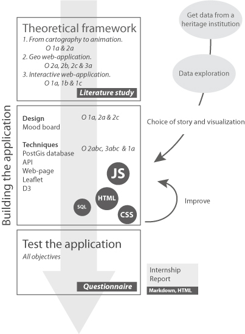

Once the general goal was established; making a web-based geo-visualization, the case study in the field of cultural heritage had to be defined. This, because the internship is conducted for the project Heritage&Location at the Waag Society. In the project several heritage institutions take part, and so came into contact with possible data providers. After explaining the general goal of this study to them, the data needed for this report was provided by  *Rijksdienst voor Cultureel Erfgoed*.
With the data, the subject of the research took more form.

The report will be build up in 3 parts; first geo-visualization and web-application techniques will be explored through literature study. With the found techniques, the web-application will be build, for which certain design objectives will be defined. In the end the application will be tested according to the set objectives and found literature.

## Theoretical framework

Three things will be looked at in the literature research.
First, a literature research is done into geo visualization techniques and already available methods. Going from the conventional cartographic techniques to the modern techniques. Including animation and change. This to cover objective 1a, to make the application attractive, and 2c, understanding the geo-data.
Second, literature about building geo-web applications and the available techniques will be consulted. To cover objectives, 2a, 2b, 2c and 3a. Adding knowledge and experience from preceding research.
Last, will be looked at some frameworks explaining how to build an efficient, attractive and interactive web-application in general. Covering objectives, 1a, 1b and 1c.

This will all be summarized into the theoretical framework which can be found in the results chapter. The found literature will be used to make decisions while building the main application. Therefor the focus of the chapter will be on the field-name data set, and its characteristics and visual variables.

## Building the web-application
After exploring the field-names dataset, a choice of story and way to visualize the data is made, which will be explained in section $$$ . This will immediately be implemented into building a web-based geo-visualization. The focus will be on building the web-application and finding the best way to visualize the data.
While doing this, decisions and choices will be made on the developed framework. There will be several things that will be taken into account during this stage.

Section $$1

-   The idea and design
Section $$2

-	Techniques needed to make the web-application. (O 3a, 3b and 3c)
-	Techniques for geo support. (O 2 and 3)
-	Visualizing of the geo data. (O 2)
Section $$3

-	Designing the webpage. (O 1a)
-	Writing the information in text, that is needed in the web page. (O 2a and 2c)

Both the design and technical building will be done by the researcher.

### The idea

Because the origin and meaning of field-names are mainly influenced by the geography of its direct environment, like water bodies, streams, soil properties and altitude in relation to its surroundings. In order to visualize this relation, as stated in objective 2a, the geographical surrounding in relation to the name has to be shown. Because the field-names are already categorized by a previous study, easily this distinction can be made.

Several ideas came up to do this, as many characteristics are of influence. The main goal for the visualization can be stated as:
> Visualize the meaning and origin of the field name by showing its relation with its direct environment.

The first ideas:

- Showing soil related field names on a soil map. This can be a current or old soil map.
- Showing height related field names on a height map.
- Showing ground water levels in relation to field names about water, swamps and soil types.
- Vegetation types, present on a field in the current situation vs what the field-name tells us about the historic vegetation.
- Showing names with relation to wind direction, in their position relative to the closest town or city

#### Main idea
Eventually one of the ideas was chosen. Namely, showing the field names on a height map. By doing this, it includes also names related to water and swamps, for lower areas are more wet then higher areas. Also vegetation types, dependent on wet or dry situations, will be included for their is a relation.

Figure # shows some fields with names related to height. Though less clear then the examples above, some fields do indicate small increases or decreases in the in relation to the area around. The Bult and the Hooge Akker are clearly on higher ground then the fields to the West. Where de zwarte kuil  indicates that it is a lower field.

 Field-names example of names with height indication on the height map 

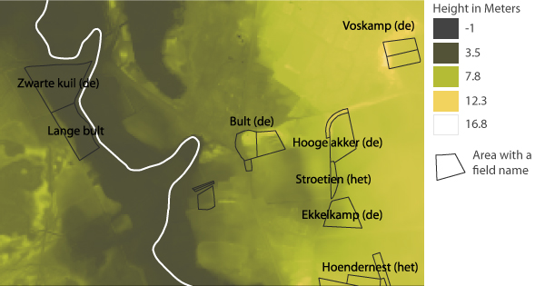

Though, field-names are only related to its direct environment, as far as the naked eye could see, for it is human invented. The relation of a field with a name can only be shown in relation to the direct environment, and not on a general overview map. For example, a name like 'Bultakker' (bump field) tells up that this field lies higher then its surrounding fields, not what the exact altitude it is.
In order to include this in the visualization, showing the polygons on a map won't be sufficient. Chosen is to draw a transect of the height data and indicate the names of the fields on this.

// tekeningetjes

Interactivity will be added to the transect line, letting the user define the transect line themselves and explore the different objects located on and around the transect line.

For this is needed:

##### Webpage
A map showing the area, where a line can be drawn to locate the position of the transect line.
A area where the defined transect line will be drawn and can be explored.
A explanation about how the application works.
Other interactive features to navigate through the webpage.

##### Data
Data about the height of the study area and all the field-names with its categories.
Additional stories and explanation texts about the meaning and origin of the field-names.
Additional pictures of the landscape characteristics.

##### Backend

Linking the data with the webpage. See paragraphs $$$$.

#### Variations on Main idea
For also on this main idea some variations can be made, these will be shown here.

- soil properties as colors of the fields. Or pattern of the specific soil type. Like stones, clay, sand etc.
Giving colors or patterns to the fields according to the soil property. Like a stonefield or redfield.

- Pop-ups with explanations and texts. Linking field-names to textual explanation, adding pictures of the surroundings and landscape characteristics. Vegetation types, animal occurrence.

- Adding pictures or symbols of vegetation types and animals on the transect line. As well as houses to indicate towns and cities. Water bodies as blue dips in the transect line.Give more explanation per category or field-name type. Include pictures of trees, shrubs, plants or animals with which the field name is connected.

- Creating a small 3d landscape by adding multiple transect lines, stacked in front of each other

- Link stories provided to the line, so popups with provided stories from the book.

#### Mood board
For design ideas and color use a mood board was made. Pictures from the Internet combined with fonts. Search terms were, living heritage, cultural heritage, transect , old transect map and more.
One of the main inspirations was the following image:

 Inspiration Picture 

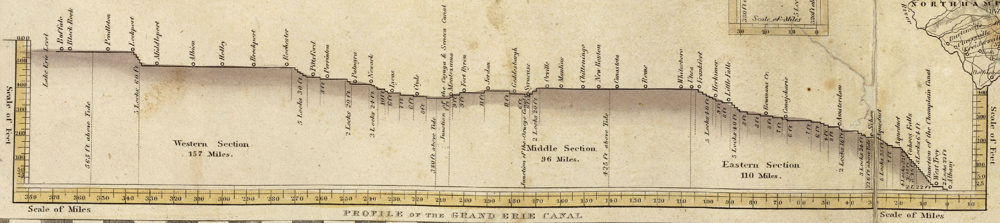

*Source: https://commons.wikimedia.org/wiki/File:1832_Erie_Canal.jpg*

Complete mood board; see appendix $$$

### The data

#### Field-names

From the *Rijksdients voor Cultureel Erfgoed* of the Netherlands a dataset with living field-names in Drenthe was supplied. This data contains field geometries that have a field-name, a name or toponym given to the plot or area by the people living in the neighborhood from around 1830. These field-names were derived from studies by Naarding and Wieringa, together with het *Drenthse Archief* and *het Meertens-Instituut*. Old toponyms on old maps, tell us a lot, but here they used another source; the memory of the local inhabitants, where generation after generation the field names keep on living. The polygons where drawn by hand or the names were assigned to plots from the cadastre maps from 1830.

These field-names contain a lot of information about how the landscape used to look. Because most field-names are based on their direct environment. The most important factors influencing the forming of field-names are ; natural relief, natural water and the vegetation structure. (Spek et al., 2009)
This information is highly important for nature conservation and heritage preservation. (Spek et al., 2009)

Further reference about the field names in Drenthe can be found in the book “Van Jeruzalem tot Ezelakker, Levende valdnamenatlas van de Drentse Aa”.  (Spek et al., 2009)

The dataset contains in total 1747 polygons with a field-name. Projection Rd new. EPSG28992

 Field-name Amounts per source 

<table>
  <tr>
      <th> Amount </th> <th> Source </th>
    </tr>
    <tr>
        <td>459 </td> <td> cadastre topographic map from 1832 </td>
    </tr>
    <tr>
        <td>452 </td> <td> Landjouw </td>
    </tr>
    <tr>
        <td>278 </td> <td> Wieringa</td>
    </tr>
    <tr>
        <td>18 </td> <td> Kadaster </td>
    </tr>
    <tr>
        <td>515 </td> <td> Drents Archief </td>
    </tr>
</table>

This results in the following coverage of field names:

<figure class="text-wrap-left">

 All fields with a field name. 

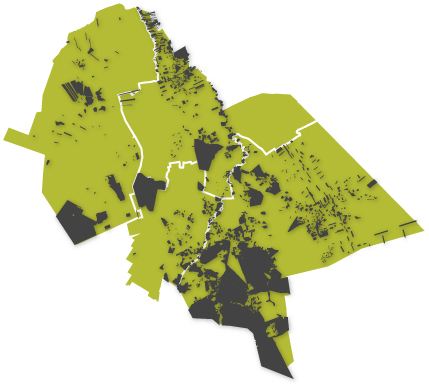
</figure>

Based on this the total research location is determined, consisting of the municipality’s Aa en Hunze, Assen, Noordenveld and Tynaarlo. All located in the watershed of the Drentse Aa.

Research area, location in the Netherlands and the municipalities

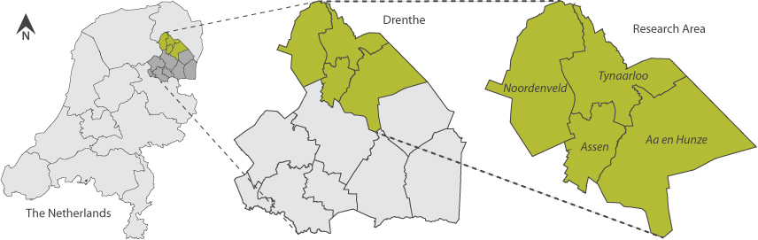

The field names are already categorized in a previous study by the RCE by $$$. The categories give a meaning to the name, of wich environmental characteristic was of influence on the name creation. These categories are given in table $$#. In the appendix $$$ a total overview of the categories and the names and alternative names can be found.

 Field-name categories 

<table>
    <tr>
        <th colspan="1">Code</th>
        <th colspan="1">Category</th>
        <th >Count old</th>
        <th >Count new</th>
    </tr>
    <tr>
    	<td>A</td><td> Altitude </td><td>116</td><td>1109</td>
    </tr>
    <tr>
    	<td>B</td><td> Soil type </td><td>79</td><td>551</td>
    </tr>
    <tr>
    	<td>C</td><td>Water related names</td><td>33</td><td>199</td>
    </tr>
    <tr>
    	<td>D</td><td>River valleys and swamps</td><td>270</td><td>926</td>
    </tr>
    <tr>
    	<td>E</td><td>Forest</td><td>175</td><td>3146</td>
    </tr>
    <tr>
    	<td>F</td><td>Drift-sand fields</td><td>59</td><td>223</td>
    </tr>
    <tr>
    	<td>G</td><td> Wild animals</td><td>38</td><td>181</td>
    </tr>
    <tr>
    	<td>O</td><td>Miscellaneous</td><td>0</td><td>85</td>
    </tr>
    <tr>
    	<td></td>
    	<td></td>
    </tr>
    <tr>
    	<td>W</td><td>Wind direction</td><td>0</td><td>165</td>
    </tr>
    <tr>
    	<td colspan=2>Total</td>
    	<td>770</td>
          	<td>6585</td>
    </tr>
</table>

#### AHN

The AHN2 tiles covering the research area were downloaded from nationaalgeoregister.nl to show the relation of the field-names with the environment. The AHN has proved useful for historical research. Small differences in the landscape can be seen in the AHN2 and already historians and archeologist use it to discover old settlements that cant be discovered with the naked eye. (Actueel Hoogtebestand Nederland, n.d.)

The raster data has a resolution of 5 meters and a precision of systematic and stochastic error of max 5 cm the projection is RD new ( EPSG28992). (Actueel Hoogtebestand Nederland, n.d.)

The maximum and minimum values of the total area are 29.5 and -1.9 meters respectively.

<figure class="text-wrap-left">

  AHN2 from the research area 

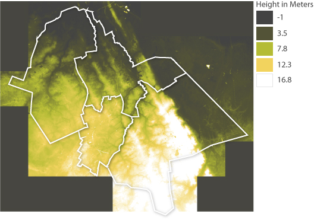
</figure>

See appendix for table with all the tiles used.

#### Kadaster parcels 1830

Data from the cadastre were also supplied by the RCE, showing the plots and parcels as they were in 1830. And can be used to refer the field-names to. The dataset is in projection RDnew(EPSG28992).

#### Water bodies

The water bodies are downloaded from the open data PDOK.nl. The Top10NLactueel contains all topology of the Netherlands on a scale of 1:25.000.
From this dataset only the water polygons are used and clipped to the research area. So the names of the water bodies can be included into the application. (“TOP10NL | Publieke Dienstverlening Op de Kaart Loket,” n.d.)
EPSG28992

 Map sheets Top10NL downloaded 

<table>
<tr> <td>Top10NL_17O</td> </tr>
 <tr>  <td>Top10NL_1rW</td></tr>
 <tr> <td>Top10NL_1rO</td></tr>
 <tr> <td>Top10NL_1rW</td></tr>
</table>

### Pre-processing the data

#### Fieldnames

All the data was delivered separate .DAT files and scattered over several folders and sources.
All the possible datasets containing field-names were collected and displayed in one view. So this results in different sources saying something about the names. This also resulted in plots with multiple names, some differed slightly, some were totally different.

In order to work with the files in Qgis all the files needed to be converted to shape-files. This was done in R. See script appendix. $$
In QGIS, manually the attribute names needed were changed in one standardized name in order to merge all the data together.

  Flowchart field-name dataset processing  

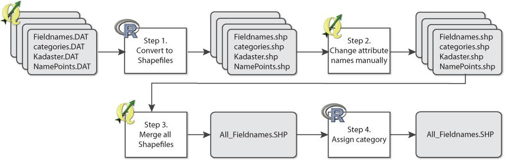

 SQL adjustments 

    UPDATE veldnamen3 SET naam = naam_2 WHERE naam IS NULL;
    UPDATE veldnamen3 SET atoto_co_3 = code_3 WHERE atoto_co_3 IS NULL;
    UPDATE veldnamen3 SET atoto_co_2 = code_2 WHERE atoto_co_2 IS NULL;
    DELETE FROM veldnamen3 WHERE naam IS NULL;
    ALTER TABLE veldnamen3 DROP COLUMN naam_2 CASCADE;
    ALTER TABLE veldnamen3 DROP COLUMN code_1_ CASCADE;
    ALTER TABLE veldnamen3 DROP COLUMN code_2 CASCADE;
    ALTER TABLE veldnamen3 DROP COLUMN code_3 CASCADE;
    ALTER TABLE veldnamen3 DROP COLUMN code_4 CASCADE;
    ALTER TABLE veldnamen3 RENAME COLUMN atoto_co_1 TO code_1;
    ALTER TABLE veldnamen3 RENAME COLUMN atoto_co_2 TO code_2;
    ALTER TABLE veldnamen3 RENAME COLUMN atoto_co_3 TO code_3;

Because this resulted into a lot of overlapping areas, instead, the field-names were all linked to the Kadaster dataset from 1830. So a single layer of polygons with multiple names is the result. This was done by spatially joining the datasets, or joining by the Kadaster ID’s which most of the datasets contained. The ID contained; municipality, sheet map number, parcel number.

Eventually, the field-names that had no category assigned had to be classified as well. The cadastre field-names and .. were not included in the previous reseach by the RCE, but were added here, to have more coverage and amount of field-names.

The classification was done in R. See appendix for the script. $$   A field-name can consist out of multiple words with a different meaning and multiple categories and lemmings can be assigned to one field name.  The classification provided by the RCE was used. This contained per category, different codes and alternative words that signifies the same.

The script  runs through all the field-names and all the possible categories, to match which category was applicable.

 While reading few of the names, new ideas for a category came up and added. The category wind direction W.

  Amount of field names with a specific category, before and after categorization in R 

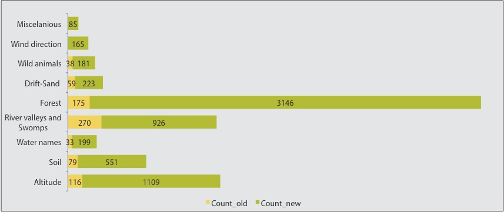

#### AHN

The AHN is measured with laser altimetry or LIDAR. Laser beams shot from an airplane and localized with GPS. It is measured over several time periods and merged in the end to get a detailed measurement of the height. The eventual end product delivered is corrected to ground level.(maaiveld) So vegetation, buildings and other object do not appear. (Actueel Hoogtebestand Nederland, n.d.) These filtered areas are given no-data values.

For use in the application, the transect line looks best when not containing any gaps. Therefore, the no-data values are filled by the fill no-data tool of Qgis. This takes an average of around 100 pixels to calculate the average height of the missing pixels.

  Flowchart AHN2 raster processing  

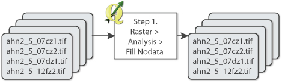

- add field to water with value = 2
- rasterize water with celsize 5
- substract from AhN with raster calculator
The water topology is .. into raster format. Giving pixel values of .. 1.5. With the raster calculator these values are subtracted from the AHN to lower the water bodies areas.

#### Kadaster parcels

No preprocessing needed other then explained in $$ preprocessing field-names.

####Water bodies

Only processing was clipped to the research area. No other preprocessing needed other then was used for the AHN.

### Back-end processes

First both client side and server side are build on one computer as a single seat set-up, in order to develop and test the processes. Once the desired result is achieved, the possibility to move it to a server will be regarded.

Figure $$ shows the overall setup of the system. On the web page a line can be drawn by LeafletDraw on the Leaflet map. The coordinates of this line are edited to a line string format and parsed into a SQL query. This query is explained in paragraph $$$. This query is asked to the API wich requests the data from the PostGIS database. The response is a geoJSON array containing the heights on every 10 meters of the line. This data is parsed back to the script of the website and used to draw the transect line and all the other characteristics needed.
The next paragraphs explain the database, the API, the SQL query and the website.

 Back-end processes 

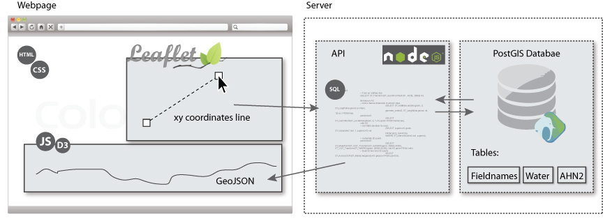

#### Setting up the database

The open source database PostgreSQL was installed with a PostGIS extension to create the needed database. It is currently the most popular free and open source spatial database (Steiniger and Hunter 2013). The PostGIS extension enables geographic objects like shape files and rasters.

Everything was loaded in the Dutch projected coordinate system RD new (EPSG:28992)

 Loading data into the database

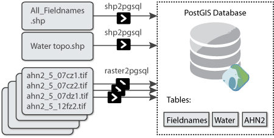

 Loading data in the database 

	Shp2pgsql
	➜  ~ shp2pgsql -s 28992 /<path name>/veldnamen.shp veldnamen | psql -U user -d veldnamen

	Raster2pgsql
	➜  ~ raster2pgsql -s 28992 -I -C /<path name>/ahn2*.tif public.ahn2 | psql -d veldnamen

####Setting up webserver or web API
A API or application programming interface, is needed to conect the web-application with the data in the PostGis database.
For this purpose Brianc node-postgres is used. Done with Node-Postgres for PostgreSQL client for node.js with pure JavaScript bindings.
The API itself is a chunk of software code written

It supports parameterizes queries for PostgreSQL

So the functions are made to get from coordinates to a SQL query asking the height data from the AHN raster.
https://github.com/brianc/node-postgres
https://nodejs.org/about/

 Request &amp; Response for transect line 

    app.get('/transect', function (req, res) {
      query(queries.transect, ['LINESTRING (' + req.query.linestring + ')'] , function(err, result) {
        if (err) {
          res.status(500).send(err);
        } else {
          res.send(result.rows.map(function(row) {
            row.geometry = JSON.parse(row.geometry);
            return row;
          }));
        }
      })
    });

#### API SQL queries

After a line is drawn on the Leaflet map with Leafleat Draw, the coordinates  of the line are inserted into the request ($1) as a LINESTRING format. The line is in WGS84 (EPSG4326) and needs to be converted to RDNew(EPSG28992) in order to extract the locationt with the other data at the right location.

 The line

    	WITH line AS
      -- Create line geometry
      (SELECT ST_Transform(ST_GeomFromText($1 , 4326), 28992) AS geom),

The line is then cut into parts of 10 meter and points are generated with its percentage location along the line.

 Point and percentage at every 10 m along the line

    linemesure AS
      (SELECT ST_AddMeasure(line.geom, 0, ST_Length(line.geom)) as linem,
      generate_series(0, ST_Length(line.geom)::int, 10) as i
      FROM line),

    points2d AS
      (SELECT ST_GeometryN(ST_LocateAlong(linem, i), 1) AS geom, (i*100/ST_Length(linem)) as percentage
      FROM linemesure),

This array of points is intersected with the  AHN table to ext rat the height value for every point.

 Get height per point

    AHN AS
    -- Get DEM elevation for each
      (SELECT p.geom AS geom, ST_Value(ahn.rast, 1, p.geom) AS heights, percentage
      FROM ahn, points2d p
      WHERE ST_Intersects(ahn.rast, p.geom)),

Also the points are intersected with the field names table to see if a points falls into a field, and wchih name and category code it belongs to.

  Get field name for intersecting points

    fields AS
        (SELECT naam AS naam, code_1_ AS category1, code_2 AS category2, ST_Intersection(p.geom, veldnamen2.geom) AS geoms
            	FROM veldnamen2, points2d p
            	WHERE ST_Intersects(veldnamen2.geom, p.geom)),

Then the points are intersected with the water topology table to see if a points falls into a water body, and wich name and category code it belongs to.

  Get field name for intersecting points

    --Get Water inersects
    waters As
    (SELECT naamnl AS waternaam, typewater AS typewater, identifica AS waterId, ST_Intersection(p.geom, water.geom) AS geomz
    FROM water, points2d p
    WHERE ST_Intersects(water.geom, p.geom)),

In the end all point that fall into a field or water body are joined to the total amount of points to contain the whole range of points.

  Join all outcomes

    points AS
    (SELECT *  FROM AHN LEFT OUTER JOIN fields ON (AHN.geom = fields.geoms)),
    points1 AS
    (SELECT * FROM points LEFT OUTER JOIN waters ON (points.geom = waters.geomz))

This is all send back as one complete GeoJSON response.

  final GeoJSON response

    -- Make points:
    SELECT ST_AsGeoJSON(ST_MakePoint(ST_X(ST_Transform(ST_SetSRID(geom, 28992),4326)), ST_Y(ST_Transform(ST_SetSRID(geom, 28992),4326)), heights))
    AS geometry, naam, heights, percentage , category1, category2, waternaam, typewater, waterID
    FROM points1

Eventually the response of the request will be a GeoJSON. An example of the GeoJSON array is shown in <a class="xref" href="#code-geojson">asdsa</a>.

Example GeoJSON response

    [
      {
        "geometry": {
          "type": "Point",
          "coordinates": [
            6.6089395293246,
            53.0818691708253,
            8.05700016021729
          ]
        },
        "naam": "Zuurpol (de)",
        "heights": 8.05700016021729,
        "percentage": 0.826035566357403,
        "category1": "A1",
        "category2": null,
        "waternaam": null,
        "typewater": null,
        "waterid": null
      },
      {…},
      {…},
      {
        "geometry": {
          "type": "Point",
          "coordinates": [
            6.62981923722014,
            53.0856490864126,
            4.8439998626709
          ]
        },
        "naam": "Gryze Steen",
        "heights": 4.8439998626709,
        "percentage": 55.5813292359005,
        "category1": null,
        "category2": null,
        "waternaam": null,
        "typewater": "meer, plas, ven, vijver",
        "waterid": "NL.TOP10NL.128375900"
      },
      {…}
    ]

### Web design

Will be an inductive process. Mostly based on the researchers’ preferences. The language in the product will be Dutch, for the data covers a part of the Netherlands and the target group is dutch.
Internet mapping applications, is software that enables a developer to deliver and view geodata and maps in a standard internet protocols and run in in a normal browser.

#### Licenses

Only use of free and open source software is used.

#### Map5

#### Technology

HTML, CSS to build the webpage and the interactivity with JavaScript .

Packages needed for building the geo-application will be leaflet and d3.js. And possible leaflet plugins like, Leaflet Draw and Leaflet MiniMap.
Leaflet is a JavaScript library for the creation of interactive maps by the founders of OpenStreetMap. Interesting for developers
is probably the focus on desktop and mobile web browsers, and its use of HTML5. (Steiniger and Hunter 2013)

Technological advancements, such as browsers that support scripting languages natively, and standards, such as Cascading
Style Sheets (CSS), Asynchronous JavaScript and
HTML 5,

Leaflet

  Leaflet map initializing 

    var basemaps ={
      "_1830": L.tileLayer('http://s.map5.nl/map/gast/tiles/tmk_1850/EPSG900913/{z}/{x}/{y}.png' ),
      "_2015": L.tileLayer('http://{s}.tile.openstreetmap.org/{z}/{x}/{y}.png'),
      "Hoogte": L.tileLayer('http://s.map5.nl/map/gast/tiles/relief_struct/EPSG900913/{z}/{x}/{y}.jpeg')
    }

    var map = new L.map('map', {
      maxZoom: 15,
      minZoom: 12,
      layers: basemaps._1830
    });

    map.setView([53.079529, 6.614894], 14);
    map.setMaxBounds([
      [52.861743, 6.458972],
      [53.202277, 6.958035]
    ]);

D3, data driven documents.

  D3 request coordinates and drawing transect path  

    d3.json('transect?linestring=' + coordinates, function(json) {
      var line = d3.select("#line")
      line.selectAll(".transect")
        .data(linestring)
        .enter()
        .append("path")
        .attr("class", "transect")
        .attr("d", lineFunction(json))
        .attr("stroke", "#2B2118")
        .attr("stroke-width", 3)
        .attr("fill", "none");
    });

## Testing the web-application

Third, a small test will be held to see if the product complies with the set goals and objectives.
During the whole process, iteratively the web visualization was adjusted and tested again until the project ends.

The final test will be conducted with a small questionnaire.
About 20 people will be asked to open the web-application and look at it, use it and play around with it. Afterwards, 8 statements will be given and asked to rate them to the level of agreeing or not. Ranks between a number of 1 and 5, from totally disagreeing till, total agreeing. 
Because the objectives were used in defining the statements, it tests if the application lives up to the objectives set for the user. 

Because there is not a official testing group available, the participants will be colleagues of the Waag Society, the heritage institutions of the Heritage and Location project and possible, classmates and/or family and friends. This to have a broad general public.  

Table $$ shows the statements asked and their relation to the objectives. The complete questionnaire can be found in annex $$$. 

 Questions and Objectives 

<table>
  <tr>
    <th> Objective </th>
    <th> Statement </th>
  </tr>
<tr> 
  <td>1</td>
  <td> 1 A</td>
  <td> I think the application is visually appealing.</td>
 </tr>
 <tr>  
   <td>2</td>
 <td> 1 B and 1 C</td>
 <td> I feel tempted to use the tools and functions in the application multiple times.</td>
 </tr>
 <tr>
    <td>3</td>
    <td> 1 C</td>
    <td>I feel tempted to use this application multiple times (in the future)
</td>
 </tr>
 <tr> <td>4</td>
 <td> 2 A and 2 C</td>
 <td>The meaning and origin of the field-names became clear to me.</td>
 </tr>
 <tr> 
   <td>5</td>
   <td> 2 B</td>
   <td>The shown information is surprising and interesting. </td>
  </tr>
  <tr> 
    <td>6</td>
    <td>2 C </td>
    <td>By using this application I understand more about the importance of safe-guarding the field-names as cultural heritage.
</td>
   </tr>
   <tr> 
     <td>7</td>
     <td>3 A</td>
     <td>The application is simple to use.</td>
    </tr>
    <tr> 
      <td>8</td>
      <td>3 B</td>
      <td>Everything was working as I expected. </td>
     </tr>
</table>

# Results

## Theoretical framework
First, a literature research is done into geo visualization techniques and already available methods which are applicable to the field-names. Describing the field-name data in the kind of data it is and the visual variables which can be linked to them. This to cover objective 1a, to make the application attractive, and 2c, understanding the geo-data.

Second, literature about building geo-web applications and the available techniques will be consulted. To cover objectives, 2a, 2b, 2c and 3 to add knowledge and experience from preceding research to the techniques which will be used here.

Last, will be looked at some frameworks explaining how to build an efficient, attractive and interactive web-application in general. Focussing on a user centered design. Covering objectives, 1a, 1b and 1c.

###Visualization of field-names
Geographical visualization can be used for 2 purposes; data exploration and information display. (Cartwright et al., 2004)  By interpreting graphic representations new knowledge can be created and this can be distributed by visual communication. The one is exploratory, whiled visual communication is explanatory. (Dibiase, Maceachren, Krygier, & Reeves, 1992)

In figure $$$ the geo processing chain is combined with the series of visualization transformations. Showing that the position of the visualization as exploration and communication. Here we will focus on the visual information communication. To turn raw data sets into understandable knowledge on the explanatory level with a user-centered design.

 Geo processing chain and visualization series 

The goal of the field-names is explanatory, while the interactivity makes the data exploratory. When looking at the Map use Cube of MacEacharen and Kraak, the field name application can be placed in the top corner. The application is about sharing information to a general and broad public. While making it interactive and so exploratory.
T

<figure class="text-wrap-right">

 Map use cube from MacEachren and Kraak 

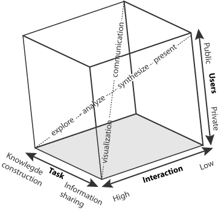
</figure>

#### Interactivity
the data sets are static data, but will be displayed dynamically and interactive. It will let the user explore, and re-discover the information themselves, called *guided discovery*. (Nöllenburg, 2007) Interaction is considered as one of the key characteristics of geovisualization, a map is nowadays seen as an interactive interface.
Interactivity lets the user explore the geo-data and be in control and not depended on the cartographer.  Interaction empowers the viewer/user to modify the data display. (Dibiase et al., 1992)(Ogao & Kraak, 2002)(Nöllenburg, 2007)

Technical functionalities for a map:

- Interactive: Zoom, filter, preform queries, different level of details.
- Be able to navigate, zoom, scroll and pan.
- Change thematic data

#### Spatial temporal scenes

###Web based geo visualizations & user centered maps
The user is no longer depended on what the cartographer puts on the map. (Ogao & Kraak, 2002) With electronic maps, the user can navigate and explore the spatial data themselves with the given functionality. In a dynamic interactive visualization, the user needs pends between data presentation and exploration. (Ogao & Kraak, 2002) Knapp(1995) defined four visualization operation tasks to be considered; identify, locate, compare and associate. Identify is describing an object, locate indicates the search for a object whose identity was already know. Associate and compare is the ability to relate between two different objects.

 Visualization operators from Ogao & Kraak 

*(Ogao & Kraak, 2002)*

A user interface for a web page should have the following basic components:

* Geo browser – the map. Spatial dimension. Let users navigate.
* Time bar – temporal dimension.
* Filters – selecting information, filter. Thematic dimension.

#### Technologies
Possible Web Map Frameworks:

- OpenLayers
- MapFish
- Leaflet
- TileMill
(Steiniger & Hunter, 2013)

OpenLayers is a library for WMS (tiled layers) and WFS (vector layers). It implements a JavaScript API for visualization of spatial data in the web browser. Without a server-side component.
(Steiniger & Hunter, 2013) (http://openlayers.org/)

MapFish, is an open source web mapping framework for building rich web-mapping applications. MapFish provides specific tools for creating web services that allows querying and editing geographic objects. (Steiniger & Hunter, 2013)  (http://mapfish.org/)

Leaflet is a web-map service WMS,that returns geo-referenced rasterized maps or tiles. In this context a map is considered a two-dimensional visualization of features in the common formats jpeg or tiff. Leaflet is open-source JavaScript library for  interactive maps. (http://leafletjs.org)

Leaflet currently compete with OpenLayers only with respect to the display of map tiles, because OpenLayers offers much more functionality when it comes to interactive and vector-based map- ping tools. Also MapFish provides much more capabilities. For this was not needed for this application, the choice was made for using Leaflet, being light and simple.

### User centered designs or Customer engagement

To engage the target group into the application, the hook model is followed.
Trigger people to use it. External or internal. Let them do a action for which they receive a reward. If they invest in the system they will go through the process again.

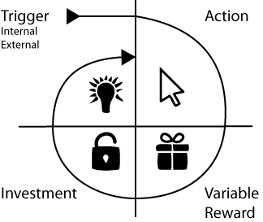

## The web application
The web application can be found on: $$$$$
Some screenshots of how it looks:

Welcome screen 

<<<<<<< HEAD

Map status in beginning 

Map functionalities with mouseover. 

Map drawing a line funciton 

Example interesting spot 

Map status in beginning 

Map functionalities with mouseover. 

Map drawing a line funciton 

Example interesting spot 

>>>>>>> e5894b926c1f0167fcef85bf23565c4396b5e32a

## Testing the web-application

### Outcome questionnaire
$$ people were asked to use the application and fill in the small questionnaire. The graph below shows the outcome of each question. With 5 being positive and 1 being negative.
Question 2 about if people were triggered to perform multiple actions was answered the most positive. Also question 5 if the user found the information surprising and interesting scored high.  Meaning that the application was perceived interesting and the user lingered around to discover more.
Question 8 got the lowest score, the functionality did not work as the user would expect.

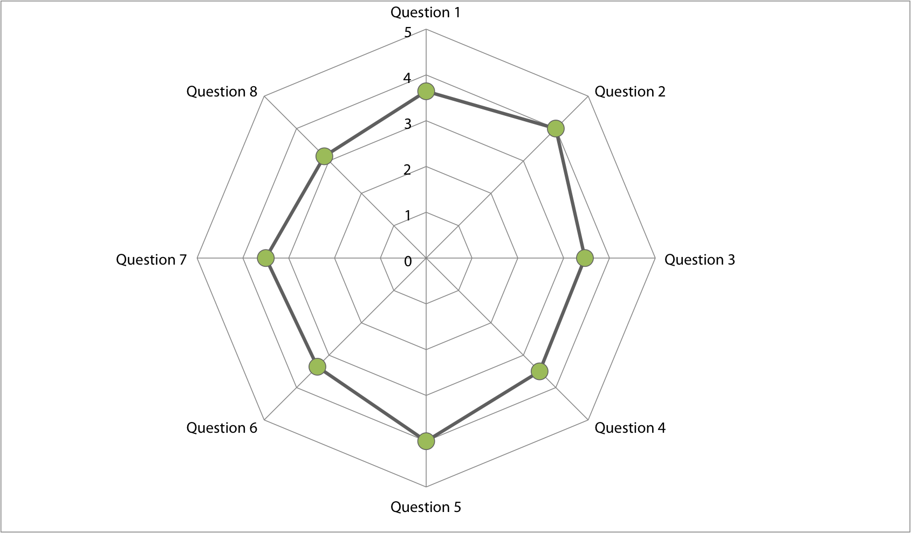

### Remarks on the questionnaire

- "works logical, though information is missing"
- "Make the pop-up disappear when the mouse moves away"
- " I miss a total overview of the page"
- "Finish line, not working.. "
- " The elevation graph should follow the x,y of mouse instead of following just x"
- " text window sometimes conflicts with the layer selector"
- "cursor on the map synchronies with the moving circle on the line"
- "also point selection, not only line"
- Ugly button on the introduction page
- I would like to know more about the different map layers
- drawing button for the line is hard to find
- While waiting, put a waiting sign.
- You would expect the information about the field to pop up when the moving circle is on the field, instead of the mouse.

# Discussion

- Too much ideas for such a short time span. Not enough knowledge for the conducting researcher in this short amount of time.

- Not enough knowledge of design or technical construction.

Lack of professional knowledge about the data

Design
Geo-visualisation is so broad and there are so many ways in which a dataset can be described that it is not possibl to set up a framework in steps to follow.

Geo data visualisation
Height is the recent height, is this still the same as in 1830?? A lot has changed since.

No temporal dimension added.

Scale is needed

Not the best way to visualize the correlation which the field-names have to their surrounding.

# Recommendations

## Website recommendations

Add more symbols and information behind it.
Make the application suitable for multiple browsers.
Let the user invest, possible idea: Draw a field and add a field name.
Implement more of the thought up ideas to make it more interesting.

# Conclusion

# References
Actueel Hoogtebestand Nederland. (n.d.). AHN - Actueel Hoogtebestand Nederland - homepage [overzichtspagina]. Retrieved July 13, 2015, from http://www.ahn.nl/index.html

Bertin, J. (2000). Matrix theory ofgraphics. Information Design Journal, 10(1), 5–19.

Blok, C. (2000). Monitoring Change: Characteristics of Dynamic Geo-spatial Phenomena for Visual Exploration. Spatial Cognition II, 1(2000), 16–30. http://doi.org/10.1007/3-540-45460-8_2

Cartwright, W., Miller, S., & Pettit, C. (2004). Geographical visualization: Past, present and future development. Journal of Spatial Science, 49(1), 25–36. http://doi.org/10.1080/14498596.2004.9635003

Cerasuolo, F., Cutugno, F., & Leano, V. A. (2012). Visualization with a New Visual Metaphor for Hierarchical and Stratified Temporal Domain. In S. D. Martino, A. Peron, & T. Tezuka (Eds.), Web and Wireless Geographical Information Systems (pp. 57–71). Springer Berlin Heidelberg. Retrieved from http://link.springer.com.ezproxy.library.wur.nl/chapter/10.1007/978-3-642-29247-7_6

Deal, L. (2014). Visualizing Digital Collections. Technical Services Quarterly, (April), 30–30. http://doi.org/10.1080/07317131.2015.972871

DEN | Home. (n.d.). Retrieved May 6, 2015, from http://www.den.nl/

Dibiase, D., Maceachren, A., Krygier, J., & Reeves, C. (1992). Animation and the Role of Map Design in Scientific Visualization. Cartography and Geographic Information Systems, 19(4), 201–&. http://doi.org/10.1559/152304092783721295

Droj, G. (2010). Cultural Heritage Conservation by GIS, 1–6.

Elwood, S. (2011). Geographic Information Science: Visualization, visual methods, and the geoweb. Progress in Human Geography, 35(3), 401–408. http://doi.org/10.1177/0309132510374250

erfgeo. (n.d.). Retrieved July 22, 2015, from http://erfgeo.nl/

Erfgoed & Locatie. (n.d.). Retrieved July 22, 2015, from http://erfgoedenlocatie.nl/

Hahmann, S., & Burghardt, D. (2013). How much information is geospatially referenced? Networks and cognition. International Journal of Geographical Information Science, 27(6), 1171–1189. http://doi.org/10.1080/13658816.2012.743664

Karavia, D., & Georgopoulos, A. (2013). Placing Intangible Cultural Heritage. Researchgate.Net, 675–678. http://doi.org/10.1109/DigitalHeritage.2013.6743815

Köbben, B., & Yaman, M. (1996). Evaluating Dynamic Visual Variables. In Proceedings of the Seminar on Teaching Animated Cartography. Madrid, Spain: International Cartographic Association. Retrieved from http://cartography.geo.uu.nl/ica/Madrid/ormeling.html

Kraak, M.-J., & Klomp, A. (1996). A Classification of Cartographic Animations: Towards a Tool for the Design of Dynamic Maps in a GIS Environment. In Proceedings of the Seminar on Teaching Animated Cartography. Madrid, Spain: International Cartographic Association. Retrieved from http://cartography.geo.uu.nl/ica/Madrid/ormeling.html

Lai, J., Luo, J., & Zhang, M. (2012). Design and Realization of the Intangible Cultural Heritage Information Management System Based on Web Map Service. Springer-Verlag Berlin Heidelberg 2012, 605–612.

Lin, H., Gong, J., & Wang, F. (1999). Web-based three-dimensional geo-referenced visualization. Computers and Geosciences, 25(10), 1177–1185. http://doi.org/10.1016/S0098-3004(99)00076-X

MacEachren, A. M., & Kraak, M.-J. (2001). Research Challenges in Geovisualization. Cartography and Geographic Information Science, 28(1), 3–12. http://doi.org/10.1559/152304001782173970

Martin, S., Reynard, E., Pellitero Ondicol, R., & Ghiraldi, L. (2014). Multi-scale Web Mapping for Geoheritage Visualisation and Promotion. Geoheritage, 6(2), 141–148. http://doi.org/10.1007/s12371-014-0102-3

Mennis, J. L., Peuquet, D. J., & Qian, L. (2000). A conceptual framework for incorporating cognitive principles into geographical database representation. International Journal of Geographical Information Science, 14(6), 501–520. http://doi.org/10.1080/136588100415710

Meyer, É., Grussenmeyer, P., Perrin, J. P., Durand, A., & Drap, P. (2007). A web information system for the management and the dissemination of Cultural Heritage data. Journal of Cultural Heritage, 8(4), 396–411. http://doi.org/10.1016/j.culher.2007.07.003

Nöllenburg, M. (2007). Geographic Visualization. In A. Kerren, A. Ebert, & J. Meyer (Eds.), Human-Centered Visualization Environments (pp. 257–294). Springer Berlin Heidelberg. Retrieved from http://link.springer.com/chapter/10.1007/978-3-540-71949-6_6

Ogao, P. J., & Kraak, M.-J. (2002). Defining visualization operations for temporal cartographic animation design. International Journal of Applied Earth Observation and Geoinformation, 4(1), 23–31. http://doi.org/10.1016/S0303-2434(02)00005-3

Ormeling, F. (1996). Teaching Animated Cartography. In Proceedings of the Seminar on Teaching Animated Cartography. Madrid, Spain: International Cartographic Association. Retrieved from http://cartography.geo.uu.nl/ica/Madrid/ormeling.html

Petrescu, F. (2007). the Use of Gis Technology in Cultural Heritage. October, (October), 1–6.

Shedroff, N. (1999). Information interaction design: A unified field theory of design. Information Design, 267–292.

Spek, T., Elerie, H., & Kosian, M. (2009). Van Jeruzalem tot Ezelakker, Levende valdnamenatlas van de Drentse Aa. Matrijs.

Steiniger, S., & Hunter, A. J. S. (2013). The 2012 free and open source GIS software map – A guide to facilitate research, development, and adoption. Computers, Environment and Urban Systems, 39, 136–150. http://doi.org/10.1016/j.compenvurbsys.2012.10.003

Tensen, T. (2014). Master Thesis Geo-data animations in television journalism :, 1–87.
TOP10NL | Publieke Dienstverlening Op de Kaart Loket. (n.d.). Retrieved July 13, 2015, from https://www.pdok.nl/nl/producten/pdok-downloads/basis-registratie-topografie/topnl/topnl-actueel/top10nl

UNESCO Culture Sector - Intangible Heritage - 2003 Convention : (n.d.). Retrieved May 6, 2015, from http://www.unesco.org/culture/ich/index.php?lg=en&pg=00002

Veldnamen - Encyclopedie Drenthe Online. (n.d.). Retrieved July 22, 2015, from http://www.encyclopediedrenthe.nl/Veldnamen

volkscultuur. (n.d.). Retrieved May 6, 2015, from http://www.volkscultuur.nl/

Waag Society. (n.d.). Retrieved July 23, 2015, from https://www.waag.org/nl/organisatie

Zeijden, A. V. D. (2011). Immaterieel erfgoed en musea, (35), 4–6.

# Appendix

### AHN tiles downloaded:

ahn2_5_07cz1.tif	ahn2_5_12en1.tif
ahn2_5_07cz2.tif	ahn2_5_12en2.tif
ahn2_5_07dz1.tif	ahn2_5_12ez1.tif
ahn2_5_07dz2.tif	ahn2_5_12ez2.tif
ahn2_5_11fz2.tif	    ahn2_5_12fn1.tif
ahn2_5_12an1.tif	ahn2_5_12fn2.tif
ahn2_5_12an2.tif	ahn2_5_12fz1.tif
ahn2_5_12az1.tif	ahn2_5_12fz2.tif
ahn2_5_12az2.tif	ahn2_5_12gn1.tif
ahn2_5_12bn1.tif	ahn2_5_12gn2.tif
ahn2_5_12bn2.tif	ahn2_5_12gz1.tif
ahn2_5_12bz1.tif	ahn2_5_12gz2.tif
ahn2_5_12bz2.tif	ahn2_5_12hn1.tif
ahn2_5_12cn1.tif	ahn2_5_12hn2.tif
ahn2_5_12cn2.tif	ahn2_5_12hz1.tif
ahn2_5_12cz1.tif	ahn2_5_17bn2.tif
ahn2_5_12cz2.tif	ahn2_5_17en1.tif
ahn2_5_12dn1.tif	ahn2_5_17en2.tif
ahn2_5_12dn2.tif	ahn2_5_12en1.tif
ahn2_5_12dz1.tif	ahn2_5_12en2.tif
ahn2_5_12dz2.tif	ahn2_5_12ez1.tif
ahn2_5_12fn1.tif	  ahn2_5_12ez2.tif

### R Sript converting files to shapefile.
	filenames <- list.files()
	filenames <- list.files(filenames , pattern = "*.TAB" ,full.names = T)

	## x = list of folder files # cat = category folder
	exportToShape <- function(x, cat){
	  for(i in 1:length(x)){
	      name <- x[i]
	      nr <- strsplit(name, "/")
	      layer <- substr(nr[[1]][2], 1, nchar(nr[[1]][2])-4 )
	      lemming <- substr(nr[[1]][2], 4, nchar(nr[[1]][2])-4)
	      file <- readOGR(name, layer)
	      file$category <- cat
	      file$lemming <- lemming
	      writeOGR(obj = file, dsn = "shape_vlak", layer = layer, driver = "ESRI Shapefile", overwrite_layer = T)
	  }
	}
	exportToShape(filenames, "overig")

### R script detecting categories

      library(sp)
      library(raster)
      library(rgdal)
      library(rgeos)
      require(RPostgreSQL)
      require(rgdal)

      setwd("/Users/waag/Documents/MGI_Stage/9_veldnamen/10_VeldnamenOrgineel/")

      # csv alle categorien en Lemmings
      categorie <- read.csv(file = 'Categorie_Alles.csv', header = T , sep=","   )

      # shapefile alle velden + namen
      velden <- readOGR(dsn = '/Users/waag/Documents/veldnamen.shp', layer = "veldnamen", stringsAsFactors = F)

      # write shapefiel back
      writeOGR(obj = velden, dsn = "veldnamen_cat.shp", layer = "veldnamen_cat", driver = "ESRI Shapefile")

      # modififing shapefile
      velden$CODE_1[velden$CODE_1 != NULL] <- velden$ATOTO_CODE
      ## correctie
      velden$CODE_1[velden$CODE_1 == "D02"] <- "D2"
      velden$CODE_1[velden$CODE_1 == "E04"] <- "E4"
      velden$CODE_1[velden$CODE_1 == 'G03'] <- "G3"
      velden$CODE_1[velden$CODE_1 == "B03"] <- "B3"
      velden$CODE_1[velden$CODE_1 == "G06"] <- "G6"
      velden$CODE_1[velden$CODE_1 == "G07"] <- "G7"
      velden$CODE_1[velden$CODE_1 == "A01"] <- "A1"
      velden$CODE_1[velden$CODE_1 == "D03"] <- "D3"
      velden$CODE_1[velden$CODE_1 == "D06"] <- "D6"
      velden$CODE_1[velden$CODE_1 == "O08"] <- "O8"
      velden$CODE_1[velden$CODE_1 == "O02"] <- "O2"

      ## categorien toevoegen
      i <- 0
      j <- 0

      for( i in 1:length(velden$NAAM)){
        naam <- velden$NAAM[i]
        for( j in 1:length(categorie$Lemming)){
          CODE <- categorie$Lemming_Code[j]
          tekst <-  paste(categorie$Lemming[j],"|",categorie$amaltertieven[j] , sep = "")
          geld <- grepl(tekst, naam, ignore.case=T)
          if(geld){
            if(is.na(velden$CODE_1[i])){
              velden$CODE_1[i] <- paste(CODE)}
            else if(is.na(velden$CODE_2[i])){
              velden$CODE_2[i] <- paste(CODE)}
          }
          print(paste(naam, tekst, CODE, geld))
        }
      }

### Mood board

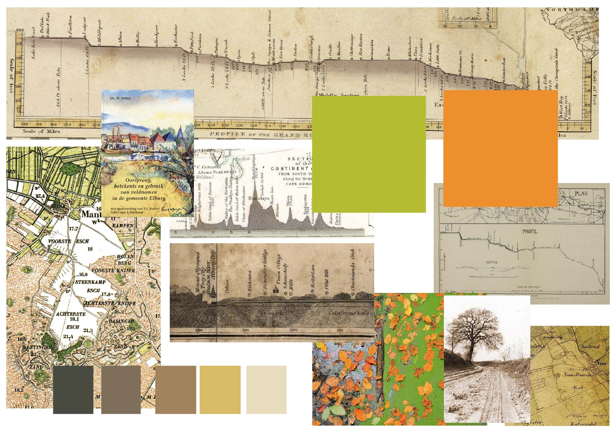
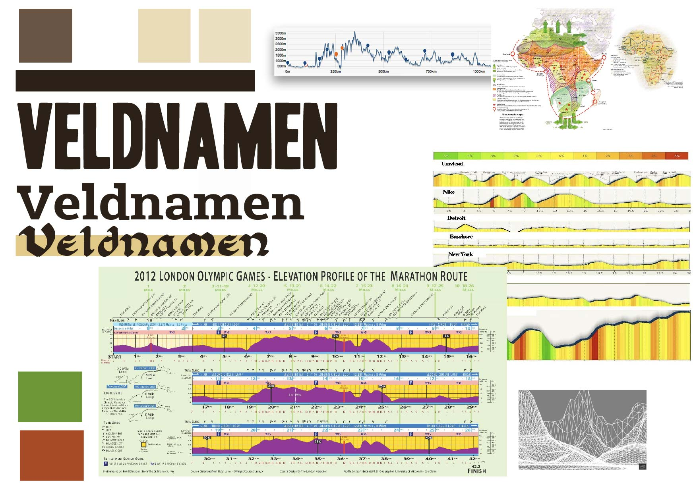

### Categories field-names form RCE

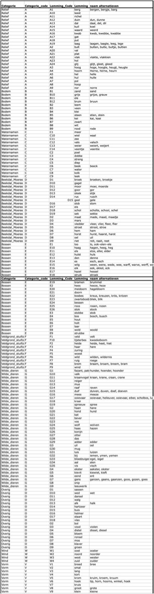
<table>
<tr> <th>	Code	</th> <th>	Count	</th></tr>
<tr><td>	A02	</td> <td>	2	</td></tr>
<tr><td>	A04	</td> <td>	3	</td></tr>
<tr><td>	A1	</td> <td>	210	</td></tr>
<tr><td>	A10	</td> <td>	13	</td></tr>
<tr><td>	A11	</td> <td>	1	</td></tr>
<tr><td>	A12	</td> <td>	39	</td></tr>
<tr><td>	A13	</td> <td>	39	</td></tr>
<tr><td>	A14	</td> <td>	18	</td></tr>
<tr><td>	A15	</td> <td>	2	</td></tr>
<tr><td>	A16	</td> <td>	4	</td></tr>
<tr><td>	A17	</td> <td>	11	</td></tr>
<tr><td>	A19	</td> <td>	1	</td></tr>
<tr><td>	A2	</td> <td>	46	</td></tr>
<tr><td>	A20	</td> <td>	499	</td></tr>
<tr><td>	A23	</td> <td>	15	</td></tr>
<tr><td>	A24	</td> <td>	2	</td></tr>
<tr><td>	A3	</td> <td>	71	</td></tr>
<tr><td>	A4	</td> <td>	58	</td></tr>
<tr><td>	A5	</td> <td>	33	</td></tr>
<tr><td>	A6	</td> <td>	7	</td></tr>
<tr><td>	A7	</td> <td>	2	</td></tr>
<tr><td>	A8	</td> <td>	2	</td></tr>
<tr><td>	A9	</td> <td>	31	</td></tr>
<tr><td>	B1	</td> <td>	80	</td></tr>
<tr><td>	B11	</td> <td>	1	</td></tr>
<tr><td>	B2	</td> <td>	3	</td></tr>
<tr><td>	B3	</td> <td>	279	</td></tr>
<tr><td>	B4	</td> <td>	15	</td></tr>
<tr><td>	B5	</td> <td>	88	</td></tr>
<tr><td>	B6	</td> <td>	2	</td></tr>
<tr><td>	B7	</td> <td>	10	</td></tr>
<tr><td>	B8	</td> <td>	46	</td></tr>
<tr><td>	B9	</td> <td>	27	</td></tr>
<tr><td>	C1	</td> <td>	88	</td></tr>
<tr><td>	C10	</td> <td>	1	</td></tr>
<tr><td>	C13	</td> <td>	1	</td></tr>
<tr><td>	C2	</td> <td>	19	</td></tr>
<tr><td>	C3	</td> <td>	14	</td></tr>
<tr><td>	C4	</td> <td>	33	</td></tr>
<tr><td>	C5	</td> <td>	15	</td></tr>
<tr><td>	C6	</td> <td>	18	</td></tr>
<tr><td>	C7	</td> <td>	4	</td></tr>
<tr><td>	C8	</td> <td>	6	</td></tr>
<tr><td>	D01	</td> <td>	2	</td></tr>
<tr><td>	D1	</td> <td>	414	</td></tr>
<tr><td>	D11	</td> <td>	1	</td></tr>
<tr><td>	D14	</td> <td>	3	</td></tr>
<tr><td>	D15	</td> <td>	5	</td></tr>
<tr><td>	D17	</td> <td>	1	</td></tr>
<tr><td>	D18	</td> <td>	6	</td></tr>
<tr><td>	D2	</td> <td>	350	</td></tr>
<tr><td>	D3	</td> <td>	18	</td></tr>
<tr><td>	D4	</td> <td>	25	</td></tr>
<tr><td>	D5	</td> <td>	13	</td></tr>
<tr><td>	D6	</td> <td>	56	</td></tr>
<tr><td>	D7	</td> <td>	23	</td></tr>
<tr><td>	D8	</td> <td>	1	</td></tr>
<tr><td>	D9	</td> <td>	8	</td></tr>
<tr><td>	E1	</td> <td>	1588	</td></tr>
<tr><td>	E11	</td> <td>	20	</td></tr>
<tr><td>	E13	</td> <td>	118	</td></tr>
<tr><td>	E14	</td> <td>	59	</td></tr>
<tr><td>	E15	</td> <td>	7	</td></tr>
<tr><td>	E16	</td> <td>	1	</td></tr>
<tr><td>	E18	</td> <td>	1	</td></tr>
<tr><td>	E2	</td> <td>	75	</td></tr>
<tr><td>	E21	</td> <td>	775	</td></tr>
<tr><td>	E24	</td> <td>	1	</td></tr>
<tr><td>	E3	</td> <td>	61	</td></tr>
<tr><td>	E4	</td> <td>	251	</td></tr>
<tr><td>	E5	</td> <td>	48	</td></tr>
<tr><td>	E6	</td> <td>	120	</td></tr>
<tr><td>	E7	</td> <td>	9	</td></tr>
<tr><td>	E8	</td> <td>	2	</td></tr>
<tr><td>	E9	</td> <td>	10	</td></tr>
<tr><td>	F1	</td> <td>	153	</td></tr>
<tr><td>	F2	</td> <td>	23	</td></tr>
<tr><td>	F3	</td> <td>	33	</td></tr>
<tr><td>	F4	</td> <td>	2	</td></tr>
<tr><td>	F5	</td> <td>	4	</td></tr>
<tr><td>	F6	</td> <td>	1	</td></tr>
<tr><td>	F7	</td> <td>	4	</td></tr>
<tr><td>	F8	</td> <td>	1	</td></tr>
<tr><td>	F9	</td> <td>	2	</td></tr>
<tr><td>	G01	</td> <td>	1	</td></tr>
<tr><td>	G05	</td> <td>	6	</td></tr>
<tr><td>	G1	</td> <td>	28	</td></tr>
<tr><td>	G10	</td> <td>	12	</td></tr>
<tr><td>	G14	</td> <td>	14	</td></tr>
<tr><td>	G15	</td> <td>	2	</td></tr>
<tr><td>	G17	</td> <td>	1	</td></tr>
<tr><td>	G18	</td> <td>	2	</td></tr>
<tr><td>	G2	</td> <td>	13	</td></tr>
<tr><td>	G20	</td> <td>	2	</td></tr>
<tr><td>	G21	</td> <td>	4	</td></tr>
<tr><td>	G23	</td> <td>	5	</td></tr>
<tr><td>	G24	</td> <td>	11	</td></tr>
<tr><td>	G25	</td> <td>	11	</td></tr>
<tr><td>	G26	</td> <td>	9	</td></tr>
<tr><td>	G27	</td> <td>	1	</td></tr>
<tr><td>	G28	</td> <td>	1	</td></tr>
<tr><td>	G29	</td> <td>	7	</td></tr>
<tr><td>	G3	</td> <td>	4	</td></tr>
<tr><td>	G30	</td> <td>	1	</td></tr>
<tr><td>	G31	</td> <td>	2	</td></tr>
<tr><td>	G32	</td> <td>	24	</td></tr>
<tr><td>	G34	</td> <td>	3	</td></tr>
<tr><td>	G35	</td> <td>	6	</td></tr>
<tr><td>	G6	</td> <td>	9	</td></tr>
<tr><td>	G7	</td> <td>	2	</td></tr>
<tr><td>	O05	</td> <td>	17	</td></tr>
<tr><td>	O07	</td> <td>	3	</td></tr>
<tr><td>	O09	</td> <td>	1	</td></tr>
<tr><td>	O10	</td> <td>	32	</td></tr>
<tr><td>	O12	</td> <td>	1	</td></tr>
<tr><td>	O17	</td> <td>	3	</td></tr>
<tr><td>	O18	</td> <td>	4	</td></tr>
<tr><td>	O2	</td> <td>	21	</td></tr>
<tr><td>	O5	</td> <td>	1	</td></tr>
<tr><td>	O8	</td> <td>	2	</td></tr>
<tr><td>	W1	</td> <td>	121	</td></tr>
<tr><td>	W2	</td> <td>	25	</td></tr>
<tr><td>	W3	</td> <td>	8	</td></tr>
<tr><td>	W4	</td> <td>	11	</td></tr>
</table>

### Questionairre for testing the application
